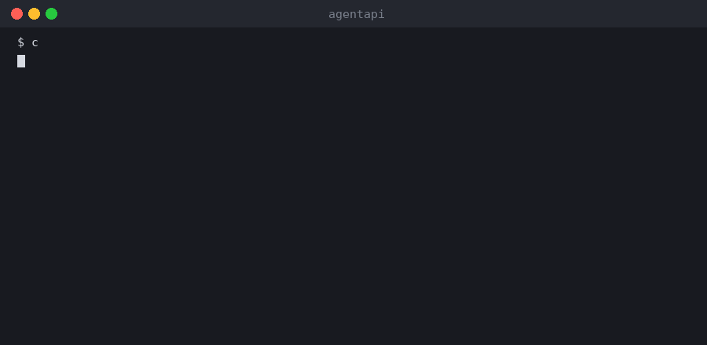
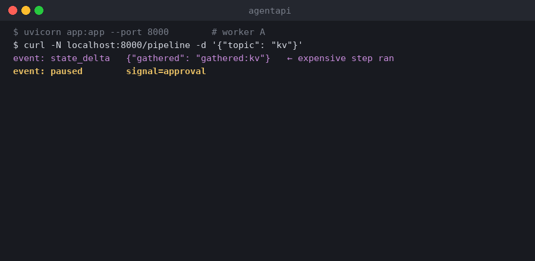
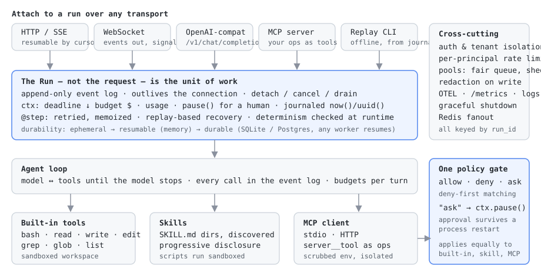

<div align="center">

# agentapi

**A server runtime where the Run — not the Request — is the unit of work.**<br>
FastAPI-shaped ergonomics for LLM, agent and orchestration workloads.

[](https://github.com/Joshuaakaspace/agentapi/actions/workflows/ci.yml)
[](pyproject.toml)
[](LICENSE)
[](tests/)
[](https://github.com/astral-sh/ruff)
[](CONTRIBUTING.md)
[](https://github.com/Joshuaakaspace/agentapi/stargazers)



*The client hangs up mid-generation. The run finishes anyway. Every token you paid for is still there.*

</div>

---

## Why this exists

FastAPI is superb at **requests**: short, stateless, owned by a TCP connection, cheap to retry.

LLM and agent workloads are none of those things. A **run** is long, stateful, multi-step, expensive to retry, must survive the connection that started it, and is metered in dollars rather than requests. Nearly every practical complaint about FastAPI-for-agents — disconnects killing generations you already paid for, streams that can't resume, no durable execution, no admission control, no budget model — is a symptom of that one mismatch.

`agentapi` keeps FastAPI's ergonomics and makes the run first-class. HTTP, SSE, WebSocket and MCP are just ways to *attach* to one.

```python
from agentapi import AgentAPI, AnthropicLLM, Done, Token, ctx

app = AgentAPI(llm=AnthropicLLM(), durable="postgresql://...")

@app.run("/chat", on_disconnect="detach", deadline="120s", budget_usd=0.50)
async def chat(prompt: str):
    async for tok in ctx.llm.stream(model="claude-opus-5",
                                    messages=[{"role": "user", "content": prompt}]):
        yield Token(text=tok)
    yield Done()
```

That route survives client disconnects, streams resumably, is journaled for crash recovery, enforces a dollar budget and a deadline, and is simultaneously reachable over SSE, WebSocket, an OpenAI-compatible endpoint and MCP. You wrote six lines.

## Quick start

```bash
pip install -e ".[dev]"
uvicorn examples.agent:app --port 8000

curl -N localhost:8000/agent -X POST -H 'content-type: application/json' \
     -d '{"task": "create hello.txt containing a haiku"}'
```

Or the whole stack with Postgres and Redis:

```bash
docker compose up
```

## See it work

<table>
<tr>
<td width="50%" valign="top">

**Human approval that survives a restart**

The policy says `write_file` needs a human. The run pauses — through `ctx.pause()`, so on a durable run the process can *exit* while it waits — and resumes the moment the signal arrives.


</td>
<td width="50%" valign="top">

**Crash mid-run, resume on another worker**

`kill -9` the worker at a pause. A fresh process claims the run from the journal, replays it — the expensive step returns its journaled result and is **not** re-executed — and carries on.



</td>
</tr>
</table>

Both are renders of real sessions captured while building the project; regenerate them with `python docs/assets/render_demos.py`.

## Architecture



## What you get

| The problem with request-shaped servers | What agentapi does |
|---|---|
| Disconnect kills the generation you paid for | `on_disconnect="detach" \| "cancel" \| "drain"` — a per-route policy, not a framework decree |
| Streams can't resume; one viewer per response | Append-only **event log** per run; any number of clients attach by cursor or `Last-Event-ID` |
| No budget or cost model | `budget_usd=` / `budget_tokens=`, nested `ctx.budget()` scopes; `BudgetExceeded` raises **mid-stream at the call site**, not on the invoice |
| No deadline propagation | `deadline="120s"` shrinks monotonically through every LLM call, tool, step and scope |
| Backends melt under load | Pools with per-tenant **fair queueing** and **deadline-aware shedding**: `429 + Retry-After` *now* rather than a timeout later; capacity adapts to upstream 429s |
| Human-in-the-loop is impossible mid-request | `await ctx.pause("approval", schema=Approval, timeout="24h")` → resumed by `POST /runs/{id}/signals/approval` |
| Process crash loses hours of agent work | SQLite or **Postgres journal**; `app.recover()` replays — steps don't re-execute, signals re-deliver, history isn't duplicated, any worker can claim a run |
| Replay-based recovery silently corrupts on nondeterminism | **Runtime determinism checker**: `time`/`random`/`uuid` outside a step raise at the offending line; replay divergence is detected, not ignored |
| Same function declared 3× (HTTP, LLM tool, MCP) | `@app.op` — one signature+docstring → HTTP route, Anthropic/OpenAI tool defs, MCP tool |
| Every project rewrites the model↔tools loop | `await app.agent(...)` — tool calls land in the event log, budgets apply per turn |
| Half-streamed JSON can't be validated | `ctx.llm.stream_as(Invoice)` yields a `PartialModel` per delta, with a bounded repair loop |
| `x-tenant-id` trusted as sent | Pluggable authenticator; tenant is authoritative; cross-tenant access is a **404**, not a 403 |
| Journal stores prompts and secrets forever | `Redactor` masks credentials, PII and named fields **on the way in** |
| One caller exhausts the process | Per-principal token-bucket rate limiting, overridable per route |
| A run can only be tailed on its owning worker | Redis Streams fanout: **any** worker serves **any** run |
| Traces, logs and requests live in three systems | OTEL spans, Prometheus `/metrics`, JSON logs — all keyed by `run_id` |
| Rolling deploys kill runs | Graceful shutdown drains in-flight work; `/readyz` reports draining so the pod leaves the LB first |
| Production runs can't be reproduced | `agentapi replay <run_id>` re-executes offline against journaled LLM responses — a free regression test |

## Build an agent on it

```python
harness = attach_harness(
    app, "/agent",
    workspace="./work",
    policy=Policy(default="ask").allow("read_file", "grep", "glob"),
    skills_dir="./skills",
)
await harness.connect_mcp("github", command=["npx", "-y", "@modelcontextprotocol/server-github"])
```

**Sandbox.** Every path resolves (symlinks *first*) inside the workspace or is refused. Commands run under CPU/memory/process/file-size rlimits with a timeout that kills the process *group*. The environment is scrubbed, so credentials in the server's environment are invisible to model-authored commands. Output is capped. This narrows blast radius for a cooperative agent — for genuinely hostile code, still run the server in a container.

**One policy gate for everything.** `allow` / `deny` / `ask`, matched on tool name and argument patterns, deny-first. Built-in tools, skill scripts and **MCP tools all pass through the same gate** — a third-party tool is not more trusted than a local one. An `ask` escalates through `ctx.pause()`, so approval survives a process restart.

**MCP in both directions.** agentapi serves MCP *and* consumes it. Adopted tools become `server__tool` ops with the server's own schema; stdio servers run as subprocesses with a scrubbed environment and resource limits; a server that dies or hangs degrades to a tool error the model can route around.

**Skills, progressively disclosed.** `Skill.discover(dir)` loads a tree of `SKILL.md` directories — the same convention Claude Code uses. The prompt carries names and descriptions; `load_skill` fetches a body on demand; bundled scripts run sandboxed.

## Performance vs FastAPI

Measured, not asserted (`python benchmarks/bench.py`, details in [BENCHMARKS.md](BENCHMARKS.md)):

| Scenario | FastAPI | agentapi |
|---|---|---|
| JSON request/response | 396 req/s | 397 req/s — **tie** |
| SSE streaming, 40 events | 237 req/s | 196 req/s — **FastAPI wins ~17%** |
| Client hangs up mid-stream | work is gone | run completes; 41 events replayable |

The streaming gap is real — sequencing and serialising each event costs ~0.3ms — and it is 0.1–0.01% of a real LLM turn. Routes that need none of it opt out with `durability="ephemeral"`.

## Surfaces

```
POST /{route}                  create a run (SSE; ?stream=false blocks)
GET  /runs/{id}/events         resumable SSE (?from= / Last-Event-ID)
WS   /ws/runs/{id}             events out, signals / cancel / drain in
POST /runs/{id}/signals/{s}    human-in-the-loop signal
POST /v1/chat/completions      OpenAI-compatible
POST /mcp                      MCP server        GET /mcp/servers  connected clients
GET  /llm/tools                tool definitions  GET /ops          catalog
GET  /healthz  /readyz         probes            GET /metrics      Prometheus
```

Have an existing FastAPI app? `app.mount("/legacy", fastapi_app)` — adopt per route, not by rewrite.

## Production

**[PRODUCTION.md](PRODUCTION.md)** is the deployment guide: the configuration to set, the details that bite (LB idle timeouts, shutdown ordering, which probe goes where, journal growth), and — deliberately — an explicit list of what is **not** yet verified.

The short version of that list: `AnthropicLLM` has been exercised far less than everything else. Every test in the suite runs on `MockLLM`. **If you run this against a real model, [tell us what happened](https://github.com/Joshuaakaspace/agentapi/issues/new?template=live_model_report.yml)** — a live report is the most valuable contribution the project can receive right now.

## Contributing

This project is young and moving fast, which means your contribution has an outsized effect on where it ends up. Start with [CONTRIBUTING.md](CONTRIBUTING.md); the quickest wins are a [live model report](https://github.com/Joshuaakaspace/agentapi/issues/new?template=live_model_report.yml), a `good first issue`, a new skill under `examples/skills/`, or an MCP server integration.

```bash
pip install -e ".[dev]" && pytest -q && ruff check agentapi tests benchmarks
```

If the Run-not-Request idea resonates, a ⭐ helps other people find it.

<div align="center">
<a href="https://star-history.com/#Joshuaakaspace/agentapi&Date"></a>
</div>

## Status

144 tests across run lifecycle, resume-by-cursor, disconnect policies, budgets, deadlines, pause/signal, steps, all op surfaces, the agent loop, hooks, skills, fair-queueing pools, crash recovery on SQLite *and* Postgres (including crash-mid-stream with no duplicated events), determinism checking, WebSocket and OpenAI-compatible transports, partial validation, the replay CLI, auth and tenant isolation, session routing, OTEL tracing, redaction, rate limiting, Redis fanout, the sandboxed harness, MCP client against real subprocess servers, and the operational surface. CI runs on Python 3.11–3.13 against real Postgres and Redis.

Read the full rationale in [DESIGN.md](DESIGN.md). MIT licensed.
